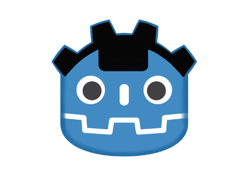

<h1 align="center">
  <br>
  
  <br>
  Godot Notch
  <br>
</h1>

<h4 align="center">Godot plugin to use Notch on Android/iOS. Support Godot 3 & 4</a>.</h4>

<p align="center">
  <a href="https://github.com/kyoz/godot-notch/releases">
    
  </a>
  <span>&nbsp</span>
  <a href="https://github.com/kyoz/godot-notch/actions">
    
  </a>
  <span>&nbsp</span>
  <a href="https://github.com/kyoz/godot-notch/releases">
    
  </a>
  <span>&nbsp</span>
  
  <span>&nbsp</span>
  
</p>

<p align="center">
  <a href="#about">About</a> •
  <a href="#installation">Installation</a> •
  <a href="#usage">Usage</a> •
  <a href="#api">API</a> •
  <a href="#contribute">Contribute</a> •
  <a href="https://github.com/kyoz/godot-notch/releases">Downloads</a> 
</p>

# About

This plugin help you easily get the safe inset (top/ bottom), help you easily layout your ui or design your game...

Was build using automation scripts combine with CI/CD to help faster the release progress and well as release hotfix which save some of our times.

Support Godot 3 & 4.

# Installation

## Android

Download the [android plugin](https://github.com/kyoz/godot-notch/releases) (match your Godot version), extract them to `your_project/android/plugins`

Enable `Notch` plugin in your android export preset

*Note*: You must [use custom build](https://docs.godotengine.org/en/stable/tutorials/export/android_custom_build.html) for Android to use plugins.

## iOS

Download the [ios plugin](https://github.com/kyoz/godot-notch/releases) (match your Godot version), extract them to `ios/plugins`

Enable `Notch` plugin in your ios export preset

# Usage

You will need to add an `autoload` script to use this plugin more easily.

Download [autoload file](./autoload) to your game (Choose correct Godot version). Add it to your project `autoload` list.

Then you can easily use it anywhere with:

```gdscript
Notch.init()

Notch.get_notch_height()
Notch.get_bottom_safe_inset()
```

Why have to call `init()`. Well, if you don't want to call init, you can change `init()` to `_ready()` on the `autoload` file. But for my experience when using a lots of plugin, init all plugins on `_ready()` is not a good idea. So i let you choose whenever you init the plugin. When showing a loading scene...etc...

For more detail, see [examples](./example/)

# API

## Methods

```gdscript
void get_notch_height() # Get top safe inset size/ notch height
void get_bottom_safe_inset() # Get bottom safe inset height
```

# Contribute

I want to help contribute to Godot community so i create these plugins. I've prepared almost everything to help the development and release progress faster and easier.

Only one command and you'll build, release this plugin. Read [DEVELOP.md](./DEVELOP.md) for more information.

If you found bug of the plugin, please open issues.

If you have time to fix bugs or improve the plugins. Please open PR, it's always welcome.

# License

MIT © [Kyoz](mailto:banminkyoz@gmail.com)